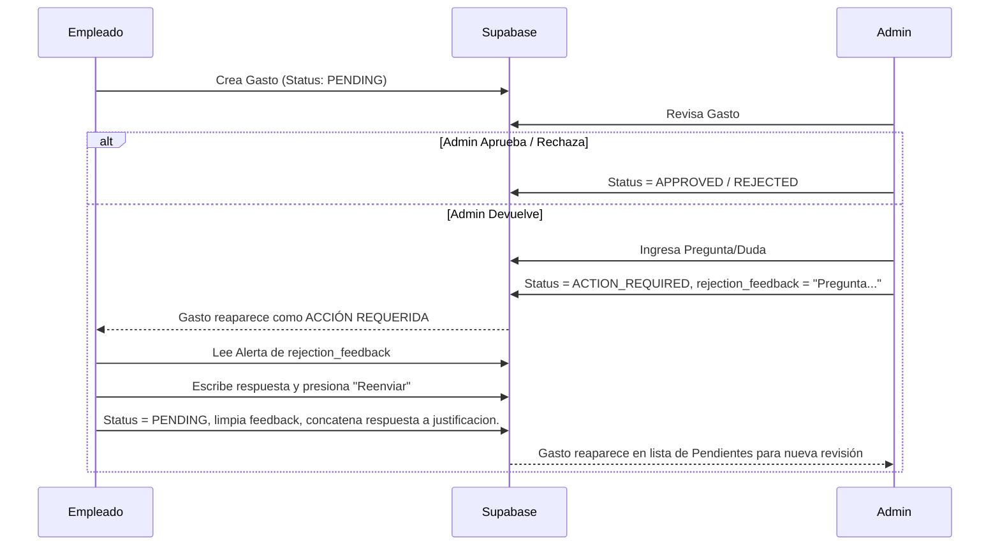

# Documentación Técnica y Funcional: PWA Control de Gastos INTTEC

Este documento contiene la arquitectura, flujos de trabajo (workflows), estructura de datos y lógica de la Aplicación Web Progresiva (PWA) de Control de Gastos. Está diseñado para proporcionar un **contexto completo** a cualquier modelo de Inteligencia Artificial o equipo de desarrollo que vaya a trabajar, mantener o escalar el proyecto.

---

## 1. Stack Tecnológico
- **Frontend**: React 18 + TypeScript + Vite.
- **Diseño UI**: Material UI (MUI) configurado con el tema visual corporativo de INTTEC (Azul Oscuro, botones vibrantes, bordes redondeados), clon 1:1 de la app de Android Jetpack Compose.
- **Backend / Base de Datos / Storage**: Supabase (PostgreSQL).
- **Offline / Caching**: IndexedDB (`idb`) para soporte offline y Service Workers para la PWA.
- **Generación de Reportes**: `jspdf` y `jspdf-autotable` para PDF. Formato nativo para CSV.
- **Inteligencia Artificial**: Google Gemini 3.5 Flash (vía REST API `fetch`) para escaneo de tickets (OCR).

---

## 2. Esquema de Base de Datos (Supabase)

La aplicación interactúa principalmente con las siguientes tablas:

- **`usuarios`**: Almacena las credenciales y el nivel de acceso.
  - Campos: `id` (uuid), `nombre`, `email`, `password`, `rol` (`'ADMIN'`, `'EMPLEADO'`), `telefono`, `created_at`.
- **`gastos`**: El núcleo de la aplicación.
  - Campos: `id`, `empleado_id` (FK a usuarios), `empleado_nombre`, `monto`, `categoria`, `subcategoria`, `cliente`, `proveedor`, `sucursal`, `metodo_pago` (Restricción CHECK: `efectivo`, `tarjeta`, `tarjeta_credito`, `tarjeta_debito`), `tipo_tarjeta`, `justificacion`, `foto_url`, `status` (`PENDING`, `APPROVED`, `REJECTED`, `ACTION_REQUIRED`), `rejection_feedback`, `created_at`, `approved_at`, `fecha_comprobante`.
- **Catálogos (`clientes`, `categorias`, `subcategorias`)**:
  - Tablas independientes para popular selectores. `subcategorias` depende directamente de `categorias` mediante `categoria_id`.

---

## 3. Flujos de Pantalla y Navegación

### A. Autenticación (`/src/pages/Login/index.tsx`)
1. Verifica si existe un objeto `user` en `localStorage`. Si existe, salta el login automáticamente y redirige según el rol.
2. Si no, solicita email y contraseña.
3. Tras la validación, redirige a `/dashboard` (Empleado) o `/admin-dashboard` (Admin).

### B. Dashboard del Empleado (`/src/pages/Dashboard/index.tsx`)
- **Pestaña Pendientes**: Muestra gastos en estado `PENDING`, `SYNC_PENDING` (guardados offline) y `ACTION_REQUIRED` (devueltos).
- **Pestaña Historial**: Muestra gastos `APPROVED` y `REJECTED`.
- **Cards de Resumen**: Calculan en tiempo real el saldo pendiente y el total aprobado.
- Al dar clic en un gasto, se abre un *Modal de solo lectura* con los detalles de compra y la foto del ticket.

### C. Dashboard del Administrador (`/src/pages/AdminDashboard/index.tsx`)
Mismas pestañas que el empleado, más una pestaña extra:
- **Personal**: Lista de usuarios registrados. Permite agregar nuevos empleados/administradores (guarda en la tabla `usuarios`).
- **Exportación**: Botón global para descargar el historial completo de gastos en `CSV` y `PDF`.
- **Menú Configuración**: Acceso a la página de Catálogos.
- **Gestión de Gasto (Modal)**: A diferencia del empleado, el modal del Admin permite 3 acciones principales: Aprobar, Devolver o Rechazar.

---

## 4. Workflows Críticos

### 4.1. Flujo de Creación de Gasto (GastoForm)
Dividido en 3 pasos secuenciales (`/src/pages/GastoForm/index.tsx`):

1. **Evidencia e IA**: 
   - El usuario captura foto (cámara o galería). 
   - Se convierte a `Base64`.
   - Se puede usar **"ESCANEAR CON IA"**. Envía la imagen al API de Google Gemini solicitando un JSON puro (`{monto, proveedor, categoria}`). Si es exitoso, autocompleta el Paso 2.
2. **Detalles Físicos**: 
   - Fecha, Monto, Proveedor, Sucursal, Método de pago. 
   - La app maneja internamente la lógica de formatear "Tarjeta" a `tarjeta` para cumplir con el `CHECK constraint` de Supabase.
3. **Categorización**:
   - Categoría, Subcategoría (filtrada automáticamente según la categoría seleccionada), Cliente y Justificación. 
   - Estos listados son *Live-fetched* desde las tablas de Supabase al abrir el formulario.
4. **Offline First**:
   - Si no hay red (`!navigator.onLine`), guarda el objeto JSON y la foto Base64 en `IndexedDB` local y le pone status `SYNC_PENDING`.
   - Si hay red, sube la foto a Supabase Storage `tickets/`, obtiene URL pública y guarda el registro SQL con status `PENDING`.

### 4.2. Flujo Interactivo de Revisión (Aprobar/Devolver/Rechazar)

### 4.3. Administrador de Catálogos (`/src/pages/CatalogosManager/index.tsx`)
- Panel de control exclusivo para `ADMIN`.
- Visualiza `clientes`, `categorias` y `subcategorias`.
- Permite la Inserción SQL en tiempo real. 
- Cuenta con un modal inteligente que, al añadir una subcategoría, despliega un menú para seleccionar el `id` de la categoría padre, mapeando correctamente la llave foránea (`categoria_id`).

---

## 5. Directrices de Mantenimiento y Reglas Futuras
1. **No alterar el `metodo_pago`**: Supabase tiene un Check Constraint riguroso. El componente manda `.toLowerCase()` para convertir "Tarjeta" en "tarjeta".
2. **Offline-Sync**: Si se modifican los campos de la tabla `gastos`, también se debe modificar la estructura de objeto en `/src/db.ts` (IndexedDB) para que la posterior sincronización asíncrona suba los nuevos campos al recuperar conexión.
3. **MUI vs Tailwind**: El proyecto utiliza **Material UI (MUI)**. Todo el styling se hace a través de la propiedad `sx={{}}`. Abstenerse de instalar/usar utilidades de TailwindCSS para evitar colisiones.
4. **Variables de Entorno**: 
   - `VITE_SUPABASE_URL`
   - `VITE_SUPABASE_ANON_KEY`
   - `VITE_GEMINI_API_KEY` (Obligatoria para la característica OCR / Escáner AI).
