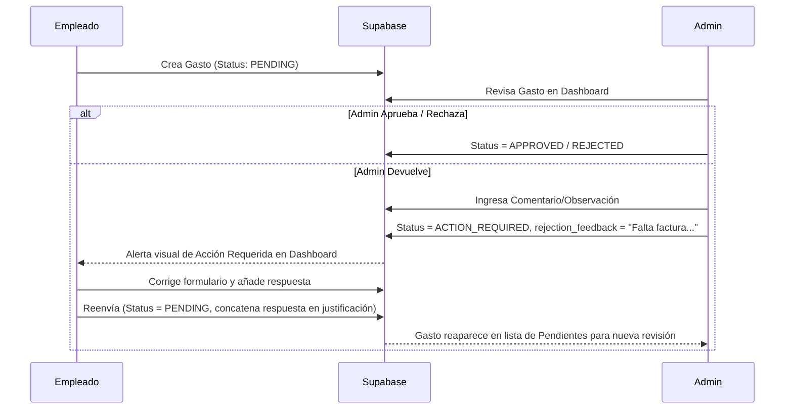

# Documentación Técnica y Funcional: App Control de Gastos y Evidencias INTTEC

Este documento contiene la arquitectura, flujos de trabajo (workflows), estructura de datos y lógica de la aplicación móvil de **Control de Gastos y Evidencias Técnicas**. Está diseñado para proporcionar un **contexto completo** a cualquier modelo de Inteligencia Artificial o equipo de desarrollo que vaya a trabajar, mantener o escalar el proyecto.

---

## 1. Stack Tecnológico
- **Core / Plataforma**: React Native + Expo (SDK 56) + TypeScript.
- **Enrutamiento y Navegación**: `expo-router` (enrutamiento basado en archivos con navegación Stack en `src/app/_layout.tsx`).
- **Diseño UI**: Hojas de estilo nativas de React Native (`StyleSheet`) configuradas con el sistema de diseño corporativo en `src/constants/theme.ts` (Soporte nativo para modo claro y oscuro, HSL tailored colors, bordes redondeados y micro-animaciones).
- **Backend / Base de Datos / Storage**: Supabase (PostgreSQL y Supabase Storage para almacenamiento de fotografías).
- **Offline / Sincronización**: `AsyncStorage` local para la cola de sincronización de gastos offline y `NetInfo` (`@react-native-community/netinfo`) en `src/services/sync.ts` para detectar la conexión a internet de forma reactiva.
- **Generación de Reportes**: `expo-print` (conversión de plantillas HTML a PDF con incrustación de logotipos y fotos en Base64/URLs) y `expo-sharing` para compartir los documentos nativamente.
- **Inteligencia Artificial**: Google Gemini 3.5 Flash (vía REST API en `src/services/gemini.ts`) utilizado para:
  1. **OCR / Escáner de Tickets**: Lee y autocompleta el formulario de gastos a partir de la foto del comprobante.
  2. **Análisis Técnico de Evidencias**: Analiza fotos de un servicio (antes y después) para redactar un reporte técnico estructurado y formal de la intervención.

---

## 2. Esquema de Base de Datos (Supabase)

La aplicación interactúa principalmente con las siguientes tablas:

- **`usuarios`**: Almacena las credenciales de ingreso y el rol de acceso.
  - Campos: `id` (uuid, PK), `nombre`, `email`, `password`, `rol` (`'ADMIN'`, `'EMPLEADO'`), `telefono`, `created_at`.
- **`gastos`**: Registro de reembolsos y compras.
  - Campos: `id` (uuid, PK), `empleado_id` (FK a usuarios), `empleado_nombre`, `monto` (numeric), `categoria`, `subcategoria`, `cliente`, `proveedor`, `sucursal`, `metodo_pago` (Restricción CHECK: `efectivo`, `tarjeta`, `tarjeta_credito`, `tarjeta_debito`), `tipo_tarjeta`, `justificacion` (incluye logs de alertas IA), `foto_url`, `status` (`PENDING`, `APPROVED`, `REJECTED`, `ACTION_REQUIRED`), `rejection_feedback`, `created_at`, `approved_at`, `fecha_comprobante`, `proveedor`, `cliente`, `sucursal`, `tipo_tarjeta`, `ubicacion_registro`, `estado`.
- **`evidencias`**: Registro histórico de actividades y reportes técnicos de trabajo.
  - Campos: `id` (uuid, PK), `empleado_id` (FK a usuarios), `empleado_nombre`, `cliente` (text), `descripcion_trabajo` (text), `materiales_usados` (text, opcional), `observaciones` (text, opcional), `foto_antes_url` (text, opcional), `foto_despues_url` (text, opcional), `resumen_ia` (text, reporte técnico IA), `created_at`.
- **Catálogos (`clientes`, `categorias`, `subcategorias`)**:
  - Tablas independientes para poblar selectores. `subcategorias` depende directamente de `categorias` mediante `categoria_id`.

---

## 3. Flujos de Pantalla y Navegación

### A. Autenticación (`src/app/index.tsx`)
1. Verifica si existe un objeto `logged_user` en el almacenamiento persistente (`AsyncStorage`). Si existe, redirige automáticamente según el rol del usuario.
2. Si no, solicita email y contraseña para validar contra la tabla `usuarios` en Supabase.
3. Tras la validación, redirige a `(empleado)/dashboard` o `(admin)/dashboard`.

### B. Módulo de Empleado
- **Dashboard (`src/app/(empleado)/dashboard.tsx`)**:
  - Visualiza el balance de gastos aprobados y pendientes en MXN.
  - Pestaña **Pendientes**: Muestra gastos `PENDING`, `ACTION_REQUIRED` y gastos offline pendientes de subida (`SYNC_PENDING`).
  - Pestaña **Historial**: Muestra gastos `APPROVED` y `REJECTED`.
  - Botones flotantes (FAB) para registrar un nuevo gasto (`/formulario`) o reportar evidencias (`/evidencia`).
  - Botón de maletín en la cabecera para abrir **Mi Trabajo** (`/trabajo`).
- **Registrar Evidencia (`src/app/(empleado)/evidencia.tsx`)**:
  - Formulario en 3 pasos: Carga de fotos (antes/después), información textual del servicio (cliente, trabajo, materiales) y generación del reporte con IA.
- **Historial de Trabajo - "Mi Trabajo" (`src/app/(empleado)/trabajo.tsx`)**:
  - Lista de reportes de servicio hechos por el empleado. Permite filtrado por cliente, ver detalles completos, imágenes remotas, y volver a compartir el PDF.

### C. Módulo de Administrador
- **Dashboard (`src/app/(admin)/dashboard.tsx`)**:
  - Muestra montos globales pendientes y aprobados en la organización.
  - Pestañas de revisión de gastos: **Revisar** (gastos pendientes con alertas visuales de política IA) e **Historial**.
  - Acciones rápidas (Botones):
    - **Personal**: Modal para agregar, editar y eliminar usuarios/roles.
    - **Reportes**: Modal para exportar el reporte global de gastos en CSV o PDF.
    - **Evidencias**: Redirige al historial de reportes de trabajo de los empleados.
    - **Catálogos**: Redirige al administrador de categorías, subcategorías y clientes.
- **Catálogos (`src/app/(admin)/catalogos.tsx`)**:
  - Panel para agregar nuevos clientes, categorías principales y subcategorías vinculadas.
- **Historial General de Evidencias (`src/app/(admin)/evidencias.tsx`)**:
  - Panel independiente para visualizar el historial técnico global.
  - Filtro horizontal deslizable de empleados para revisar reportes de técnicos específicos.
  - Buscador de clientes y visor de detalles completos con fotos y descarga de PDF.

---

## 4. Workflows Críticos

### 4.1. Flujo de Creación de Gasto y Soporte Offline
1. El empleado toma foto del ticket de compra y puede presionar **"ESCANEAR CON IA"**.
2. Gemini extrae los datos y autocompleta el formulario.
3. **Guardado Offline First**:
   - Si no hay red (`!NetInfo.isConnected`), el registro y la foto (Base64) se guardan localmente mediante la cola de sincronización de `SyncService`.
   - Si hay red, se sube la foto a Supabase Storage (`tickets/`), se obtiene la URL pública y se inserta el registro en la tabla `gastos` con estado `PENDING`.
   - Cuando se recupera conexión a internet, el Listener de Red sube de manera automática los registros pendientes.

### 4.2. Flujo de Revisión de Gastos (Devolución)

### 4.3. Flujo de Registro Técnico y Evidencias de Trabajo
1. El técnico captura foto inicial (Antes) y foto final (Después).
2. Rellena los detalles del servicio y los materiales utilizados.
3. Presiona **"GENERAR REPORTE CON IA"**: Gemini analiza las fotos y los detalles para redactar un informe formal.
4. Genera la cabecera oficial en PDF utilizando la imagen del icono de INTTEC codificada en Base64, garantizando renderizado instantáneo y sin fallos de lectura de archivos locales en la WebView de `expo-print`.
5. Si decide **Guardar en el Servidor**: Sube las fotos al bucket `tickets/`, obtiene las URLs públicas y guarda el reporte técnico en la tabla `evidencias`.

---

## 5. Directrices de Desarrollo y Mantenimiento
1. **Diferencia de Modelos en Gastos**: La restricción CHECK en Supabase obliga a enviar los métodos de pago en minúsculas (`efectivo`, `tarjeta`, `tarjeta_credito`, `tarjeta_debito`). No alterar estas conversiones en los formularios.
2. **Generación de Reportes PDF**: La renderización de logotipos e imágenes en `expo-print` debe realizarse preferentemente mediante Base64 o URLs remotas públicas directas. No intentar referenciar recursos de la carpeta local de assets (`../../assets/...`) usando URIs relativas en las plantillas HTML, ya que fallará al compilarse en los emuladores o dispositivos físicos por seguridad de la WebView.
3. **Unicidad de Iconos y Componentes**: El diseño utiliza el tema visual global y los iconos nativos de `Ionicons` de Expo Router. Mantener siempre la coherencia del esquema de colores (Modo Oscuro/Claro).
